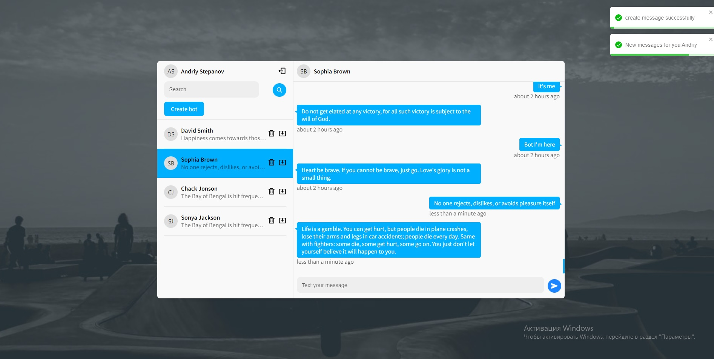
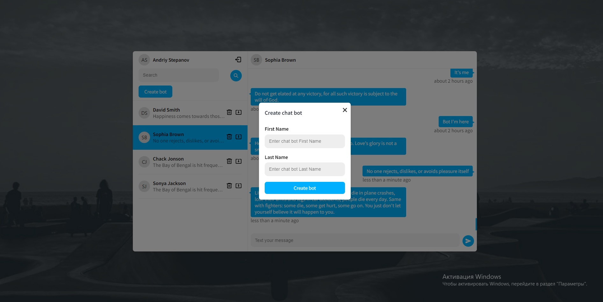
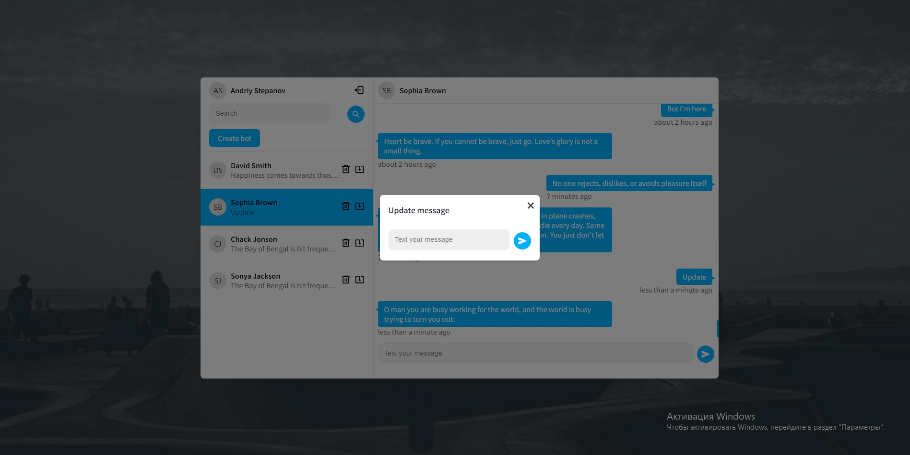

# Reenbit test task

## Screenshots

## Backend Link

https://github.com/AndriySt92/chat_test_task_backend

## Frontend

- React
- Redux-toolkit/RTK query
- Typescript
- React-hook-form
- React-toastify
- React-router-dom
- Socket.io
- Classnames
- Date-fns

## Backend

- Express
- MongoBD
- Express-validator
- Mongoose
- Socket.io